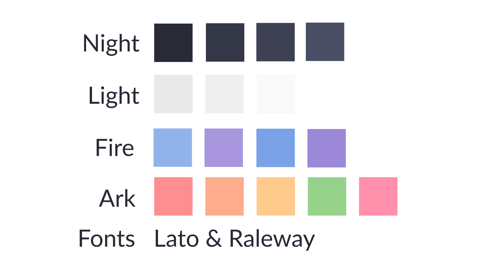

**FirarkEnv** are the dotfiles I currently use, with several themes forked and developped under the brand *Firark*.

Everything is made to be consistent accross applications and devices. I use the *Firark colors* everywhere, that I designed as follow :

Installation can be easily managed with the `deploy.sh` script.

## Apps

* Bspwm (v0.9.2 because of the focus click) for the Window Manager
* Compton for animations
* Dunst for notifications
* Fish for the shell
* GTK and QT for windows
* Polybar for the bar
* Sxhkd for the hotkeys daemon
* Urxvt for the term
* Rofi for the menu
* i3lock with a custom script for the lock
* Sddm for the Display manager
* Plymouth for the boot screen

And more than that, I use for code :

* Vim
* Pycharm

## Visual

Here is what I use for the visual :

* Arc Theme modified
* Arc Icon Theme
* Moka Icon Theme
* Firark colors
